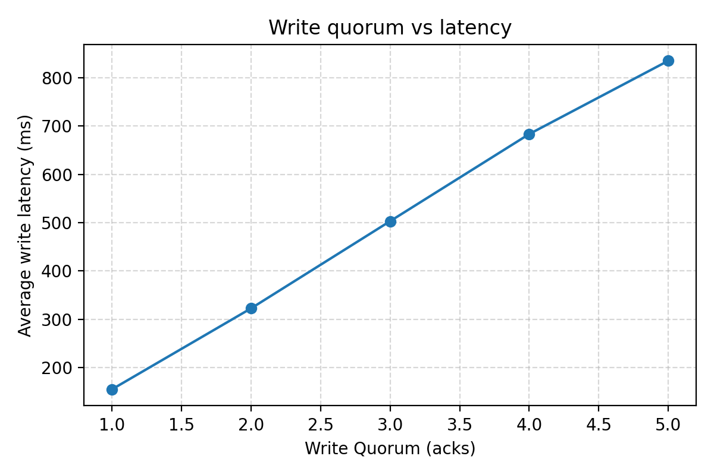

# PR Lab 4 – Leader-Follower Key-Value Store

**Author:** Clima Marin  
**Group:** FAF-231  
**Course:** Programarea în Rețea (PR)

---

## Lab Task

> Implement a key-value store with single-leader replication (only the leader accepts writes, replicates them on all the followers). Both the leader and the followers should execute all requests concurrently. Run one leader and 5 followers in separate docker containers using docker-compose. Configure everything through environment variables inside the compose file. Use a web API and JSON for communication.
>
> Leader uses semi-synchronous replication (read about it in the book), the number of confirmations from followers required for a write to be reported successful to the user ("write quorum") is configurable through an env. var. set in docker compose.
>
> To simulate network lag, on the leader side, add a delay before sending the replicate request to a follower, in the range [MIN_DELAY, MAX_DELAY], for example [0ms, 1000ms]. The replication requests to the followers should be done concurrently, so the delays will differ.
>
> Write an integration test to check that the system works as expected.
>
> Analyze the system performance by making ~100 writes concurrently (10 at a time) on 10 keys:
> - Plot the value of the "write quorum" (test values from 1 to 5) vs. the average latency of the write operation. Explain the results.
> - After all the writes are completed, check if the data in the replicas matches the data on the leader. Explain the results.

---

## Summary of Implementation

I built a minimal **FastAPI-based key-value store** that demonstrates single-leader replication with semi-synchronous writes. The system includes:

- **Leader node** that accepts client writes (`PUT /kv/{key}`) and replicates them to followers.
- **Five follower nodes** that only accept internal `/replicate` calls and serve reads.
- **Semi-synchronous quorum**: the leader waits for a configurable number of follower ACKs before confirming success to the client.
- **Simulated network lag**: each replication call is delayed by a random value in `[MIN_DELAY_MS, MAX_DELAY_MS]`.
- **Docker Compose topology** with all configuration via environment variables.
- **Integration tests** verifying quorum enforcement and replication.
- **Performance harness** that benchmarks latency vs quorum and validates replica parity.

---

## Implementation Details

### 1. Single-Leader Replication

Only the leader accepts writes. The `put_value` endpoint in `app/main.py` checks the node's role:

```python
@app.put("/kv/{key}")
async def put_value(key: str, request: WriteRequest, ...):
    if config.role != "leader":
        raise HTTPException(status_code=403, detail="Writes allowed only on leader")
    
    timestamp = time.time()
    await store.set(key, request.value, timestamp)
    
    follower_acks = await replicate_to_followers(config, key, request.value, timestamp, client)
    # ...
```

Followers receive replicated writes via the `/replicate` endpoint:

```python
@app.post("/replicate")
async def replicate(request: ReplicateRequest) -> dict:
    await store.set(request.key, request.value, request.timestamp)
    return {"status": "ok"}
```

### 2. Concurrent Request Handling

Both leader and followers use **async handlers** with FastAPI. The in-memory store (`app/kv_store.py`) uses `asyncio.Lock` for thread-safe concurrent access:

```python
class AsyncKVStore:
    def __init__(self) -> None:
        self._data: Dict[str, Record] = {}
        self._lock = asyncio.Lock()

    async def set(self, key: str, value: str, timestamp: float) -> None:
        async with self._lock:
            current = self._data.get(key)
            if current is None or timestamp >= current.timestamp:
                self._data[key] = Record(value=value, timestamp=timestamp)
```

### 3. Semi-Synchronous Replication with Configurable Quorum

The leader fans out replication **concurrently** using `asyncio.create_task` and waits for the required number of ACKs:

```python
async def replicate_to_followers(...) -> int:
    tasks = [asyncio.create_task(replicate(url)) for url in cfg.follower_urls]
    follower_acks = 0

    for future in asyncio.as_completed(tasks):
        success = await future
        if success:
            follower_acks += 1
        if follower_acks >= cfg.write_quorum:
            break  # Quorum reached, return early
    # ...
```

If quorum isn't met, the leader returns HTTP 503:

```python
if not quorum_met:
    raise HTTPException(
        status_code=503,
        detail={"message": "Write quorum not met", "follower_acks": follower_acks, "required": config.write_quorum}
    )
```

### 4. Simulated Network Lag

Before each replication call, a random delay is introduced:

```python
async def replicate(url: str) -> bool:
    delay_ms = random.uniform(cfg.min_delay_ms, cfg.max_delay_ms)
    await asyncio.sleep(delay_ms / 1000.0)
    # ... send POST to follower
```

### 5. Docker Compose Configuration

`docker-compose.yml` defines one leader and five followers, all configured via environment variables:

```yaml
services:
  leader:
    build: .
    environment:
      ROLE: leader
      NODE_ID: leader
      WRITE_QUORUM: 3
      MIN_DELAY_MS: 0
      MAX_DELAY_MS: 1000
      FOLLOWER_URLS: "http://follower1:8000,http://follower2:8000,..."
    ports:
      - "8000:8000"

  follower1:
    build: .
    environment:
      ROLE: follower
      NODE_ID: follower1
  # ... follower2 through follower5 similarly
```

### 6. Configuration via Environment Variables

`app/config.py` loads all settings from the environment:

```python
@dataclass
class LeaderConfig(BaseConfig):
    write_quorum: int = int(os.getenv("WRITE_QUORUM", "3"))
    min_delay_ms: int = int(os.getenv("MIN_DELAY_MS", "0"))
    max_delay_ms: int = int(os.getenv("MAX_DELAY_MS", "1000"))
    # ...
```

---

## System Flow

```
┌────────────────────────────────────────────────────────────────────┐
│                           CLIENT                                   │
│                    PUT /kv/mykey {"value":"X"}                     │
└────────────────────────────────┬───────────────────────────────────┘
                                 │
                                 ▼
┌────────────────────────────────────────────────────────────────────┐
│                           LEADER                                   │
│  1. Check role == "leader"                                         │
│  2. Store locally: store.set("mykey", "X", timestamp)              │
│  3. Fan out replication concurrently to all followers              │
│     (each with random delay in [MIN_DELAY, MAX_DELAY])             │
│  4. Wait for WRITE_QUORUM follower ACKs                            │
│  5. Return success or 503 if quorum not met                        │
└───────┬──────────┬──────────┬──────────┬──────────┬────────────────┘
        │          │          │          │          │
        ▼          ▼          ▼          ▼          ▼
   ┌─────────┐┌─────────┐┌─────────┐┌─────────┐┌─────────┐
   │Follower1││Follower2││Follower3││Follower4││Follower5│
   │ /repli- ││ /repli- ││ /repli- ││ /repli- ││ /repli- │
   │  cate   ││  cate   ││  cate   ││  cate   ││  cate   │
   │  ACK ✓  ││  ACK ✓  ││  ACK ✓  ││  ACK ✓  ││  ACK ✓  │
   └─────────┘└─────────┘└─────────┘└─────────┘└─────────┘
```

---

## API Reference & Technical Details

### Endpoints

| Endpoint | Method | Role | Description |
|----------|--------|------|-------------|
| `/kv/{key}` | `GET` | All | Retrieve the value for a given key. Returns `{"key": "...", "value": "..."}`. |
| `/kv/{key}` | `PUT` | Leader | Write a key-value pair. Body: `{"value": "..."}`. Replicates to followers and waits for quorum. |
| `/replicate` | `POST` | Follower | Internal endpoint for leader to push replicated writes. Body: `{"key": "...", "value": "...", "timestamp": ...}`. |
| `/dump` | `GET` | All | Returns all key-value pairs in the local store (for debugging/parity checks). |
| `/health` | `GET` | All | Health check. Returns `{"status": "ok", "role": "...", "node_id": "..."}`. |
| `/admin/quorum` | `POST` | Leader | Dynamically update write quorum at runtime. Body: `{"write_quorum": int}`. |
| `/admin/replica-status` | `GET` | Leader | Returns leader's data plus each follower's `/dump` output for parity comparison. |

### Environment Variables

| Variable | Default | Description |
|----------|---------|-------------|
| `ROLE` | `leader` | Node role: `leader` or `follower`. Only leader accepts client writes. |
| `NODE_ID` | `node` | Unique identifier for the node (used in logs and health endpoint). |
| `HOST` | `0.0.0.0` | Host address to bind the server. |
| `PORT` | `8000` | Port to listen on. |
| `WRITE_QUORUM` | `3` | Number of follower ACKs required before confirming a write (leader only). |
| `MIN_DELAY_MS` | `0` | Minimum simulated network delay (ms) before replication (leader only). |
| `MAX_DELAY_MS` | `1000` | Maximum simulated network delay (ms) before replication (leader only). |
| `REQUEST_TIMEOUT` | `5` | Timeout (seconds) for replication HTTP requests (leader only). |
| `FOLLOWER_URLS` | `""` | Comma-separated list of follower base URLs, e.g., `http://follower1:8000,http://follower2:8000` (leader only). |

### Concurrency Model

- **FastAPI async handlers**: All endpoints are `async def`, allowing the server to handle many concurrent requests without blocking.
- **Concurrent replication**: The leader uses `asyncio.create_task()` to fire replication requests to all followers in parallel. It then uses `asyncio.as_completed()` to process ACKs as they arrive, returning as soon as quorum is reached.
- **Non-blocking I/O**: HTTP calls to followers use `httpx.AsyncClient`, which is fully async and non-blocking.
- **Workload concurrency**: The performance harness uses `asyncio.Semaphore(10)` to limit concurrent writes to 10 at a time while still allowing parallel execution.

### Thread Safety

- **`asyncio.Lock`**: The `AsyncKVStore` class protects all read/write operations with an async lock to prevent race conditions when multiple coroutines access the store simultaneously.
- **Timestamp-based conflict resolution**: Each write carries a timestamp. The store only accepts a write if its timestamp is >= the current value's timestamp, ensuring last-write-wins semantics even under concurrent updates.
- **Single-threaded event loop**: Python's asyncio runs in a single thread, so there are no true thread-safety issues—only coroutine interleaving. The lock ensures atomic read-modify-write sequences.

```python
async def set(self, key: str, value: str, timestamp: float) -> None:
    async with self._lock:  # Prevents concurrent modifications
        current = self._data.get(key)
        if current is None or timestamp >= current.timestamp:
            self._data[key] = Record(value=value, timestamp=timestamp)
```

---

## Integration Tests

`tests/test_integration.py` verifies the system behavior:

**Test 1: Leader Write with Quorum**
- Configures leader with 5 followers and quorum=3
- Mocks replication so followers 1-3 succeed, 4-5 fail
- Verifies write succeeds with exactly 3 ACKs

**Test 2: Follower Replication Endpoint**
- Sends a `/replicate` request directly to a follower
- Verifies the data is stored correctly

### Test Output

```
$ python -m pytest -s tests/test_integration.py

tests\test_integration.py
[test_leader_write_with_quorum] configuring leader with five followers and quorum=3
[test_leader_write_with_quorum] resetting in-memory store
[test_leader_write_with_quorum] issuing client PUT /kv/test
[test_leader_write_with_quorum] attempting replication to http://follower1:8000/replicate
[test_leader_write_with_quorum] attempting replication to http://follower2:8000/replicate
[test_leader_write_with_quorum] attempting replication to http://follower3:8000/replicate
[test_leader_write_with_quorum] attempting replication to http://follower4:8000/replicate
[test_leader_write_with_quorum] attempting replication to http://follower5:8000/replicate
[test_leader_write_with_quorum] response status=200, body={'key': 'test', 'value': '123', 'follower_acks': 3, 'quorum_met': True}
[test_leader_write_with_quorum] stored value for test=123
[test_leader_write_with_quorum] verified quorum enforcement and replication fan-out
.
[test_follower_replication_endpoint] configuring follower role
[test_follower_replication_endpoint] posting replication payload to follower
[test_follower_replication_endpoint] response status=200, body={'status': 'ok'}
[test_follower_replication_endpoint] stored value for alpha=beta
[test_follower_replication_endpoint] follower applied replicated write successfully
.

================================== 2 passed ==================================
```

---

## Performance Analysis

The script `scripts/run_workload.py` performs:
1. Spawns a local cluster (1 leader + 5 followers)
2. Runs **100 writes** with **concurrency of 10** across **10 keys**
3. Tests quorum values from **1 to 5**
4. Records average latency per quorum
5. Checks replica parity after completion

### Latency vs Quorum Plot



*Screenshot: The plot shows average write latency increasing as the write quorum increases.*

### JSON Summary Output

```json
{
  "leader_url": "http://127.0.0.1:8000",
  "results": [
    {"quorum": 1, "avg_latency_ms": 190.66},
    {"quorum": 2, "avg_latency_ms": 337.99},
    {"quorum": 3, "avg_latency_ms": 476.58},
    {"quorum": 4, "avg_latency_ms": 682.95},
    {"quorum": 5, "avg_latency_ms": 849.97}
  ],
  "parity": [
    {"url": "http://127.0.0.1:8001", "status": "match"},
    {"url": "http://127.0.0.1:8002", "status": "match"},
    {"url": "http://127.0.0.1:8003", "status": "match"},
    {"url": "http://127.0.0.1:8004", "status": "match"},
    {"url": "http://127.0.0.1:8005", "status": "match"}
  ],
  "plot": "reports\\quorum_vs_latency.png"
}
```

### Explanation of Latency Results

**Why does latency increase with higher quorum?**

With semi-synchronous replication, the leader must wait for `WRITE_QUORUM` follower acknowledgements before returning success to the client. Each follower receives a random delay in `[0ms, 1000ms]`:

| Quorum | What the leader waits for | Expected latency |
|--------|---------------------------|------------------|
| 1 | Fastest 1 of 5 followers | ~190 ms (min delay) |
| 2 | 2nd fastest follower | ~338 ms |
| 3 | 3rd fastest (median) | ~477 ms |
| 4 | 4th fastest | ~683 ms |
| 5 | Slowest follower | ~850 ms (near max delay) |

The leader returns as soon as enough ACKs arrive. With quorum=1, it only needs the fastest follower. With quorum=5, it must wait for all followers, including the slowest one.

### Explanation of Parity Results

**Why do all replicas match the leader?**

All five followers show `"status": "match"` because:

1. **Eventual consistency**: Even though the leader returns after quorum is met, replication continues in the background to remaining followers.
2. **No failures during test**: All followers were healthy and received all writes.
3. **Timestamp-based ordering**: The store uses timestamps to resolve conflicts, ensuring consistent final state.

If a follower had been unreachable or crashed, the parity check would show `"status": "mismatch"` with the differing keys listed.

---

## How to Run

### Prerequisites
- Python 3.12+
- pip
- Docker + Docker Compose (optional, for containerized deployment)

### Install Dependencies
```powershell
python -m pip install -r requirements.txt
```

### Run Integration Tests
```powershell
python -m pytest -s tests/test_integration.py
```

### Run Performance Analysis
```powershell
python scripts/run_workload.py
```

### Docker Deployment
```powershell
docker compose up --build      # Start cluster
docker compose down -v         # Tear down
```

---

## Project Structure

```
app/
  __init__.py
  config.py          # Environment-driven configuration
  kv_store.py        # Async in-memory key-value store
  main.py            # FastAPI application with all endpoints
scripts/
  run_workload.py    # Performance analysis harness
tests/
  test_integration.py # Integration tests
reports/
  perf_summary.json   # Benchmark results
  quorum_vs_latency.png # Latency plot
docker-compose.yml   # Multi-container topology
Dockerfile           # Container image definition
requirements.txt     # Python dependencies
```

---

## Conclusions

1. **Single-leader replication works**: Only the leader accepts writes and successfully replicates them to all followers using async HTTP calls.

2. **Semi-synchronous quorum provides tunable durability**: By adjusting `WRITE_QUORUM`, we can trade off between latency and durability. Lower quorum = faster writes but less redundancy guaranteed at response time.

3. **Concurrent replication with simulated lag demonstrates real-world behavior**: The random delays show how network latency affects write performance, and why waiting for more replicas costs more time.

4. **Replica parity is maintained**: After the workload completes, all followers contain identical data to the leader, proving the replication mechanism works correctly.

5. **The system is fully configurable via environment variables**: This makes it easy to deploy with different settings in Docker Compose or any container orchestrator.
